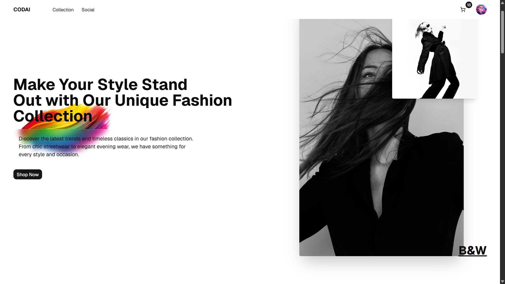
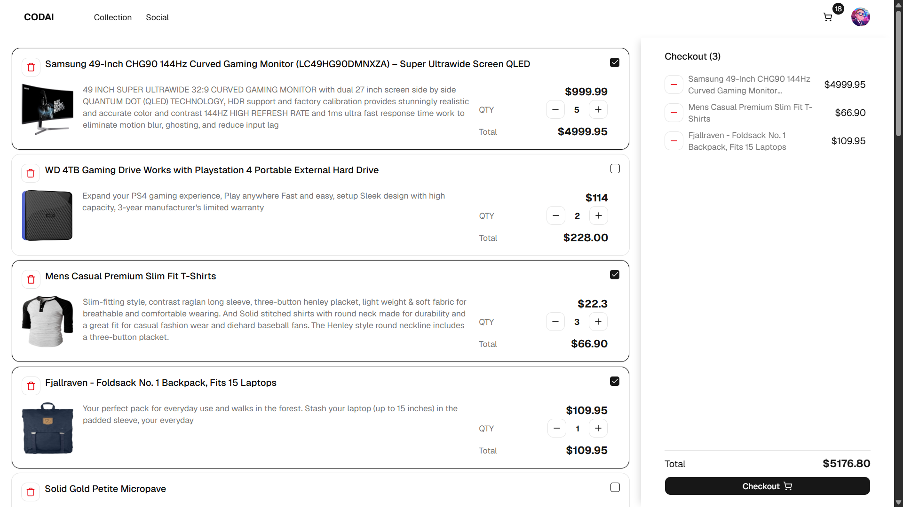

# 🛍️ Codai – Modern E-Commerce Web App

Codai is a modern e-commerce web application built with **TypeScript** and designed to deliver a smooth and responsive shopping experience. The project focuses on clean UI, interactive animations, and scalable frontend architecture while using a fake API for product data simulation.

## ✨ Features

- 🛒 **Product Catalog**  
  Browse products through a clean and responsive storefront.

- 🔍 **Search & Discover**  
  Quickly find products with an intuitive search experience.

- ⚡ **Smooth Animations**  
  Interactive transitions and motion effects powered by Motion.

- 🎨 **Modern UI with shadcn/ui**  
  Reusable and accessible UI components for consistent design.

- 📱 **Responsive Design**  
  Optimized experience across desktop and mobile devices.

- 📦 **Fake API Integration**  
  Simulated backend communication for product fetching and testing.

- 🧩 **Component-Based Architecture**  
  Maintainable and scalable frontend structure.

- 🚀 **Fast Development Experience**  
  Built with TypeScript for better type safety and developer productivity.

---

## 🖼️ Screenshots

| Home | Collection | Recommended |
|------|---------------|------|
|  |  |  |

| Social | Footer | Cart |
|------|---------------|------|
|  |  |  |

| SingIn |
|------|
|  |

---

## 🛠️ Tech Stack

- ⚛️ **React**
- 🔷 **TypeScript**
- 🎞️ **Motion**
- 🎨 **shadcn/ui**
- 🌐 **Fake API**
- 💨 **Tailwind CSS**

---

## 📂 Project Structure

```bash
src
├── app
├── components
├── hooks
├── services
├── types
├── lib
├── pages
└── assets
```

---

## 🚀 Getting Started

Clone the repository:

```bash
git clone https://github.com/mrowenhuang/e-commerce.git
```

Go to project directory:

```bash
cd e-commerce
```

Install dependencies:

```bash
npm install
```

Start development server:

```bash
npm run dev
```

Build production:

```bash
npm run build
```

---

## 🌍 Live Preview

Coming soon...

---

## 👨‍💻 Author

Built by **Owen Huang**  
Passionate about creating modern and responsive web experiences.